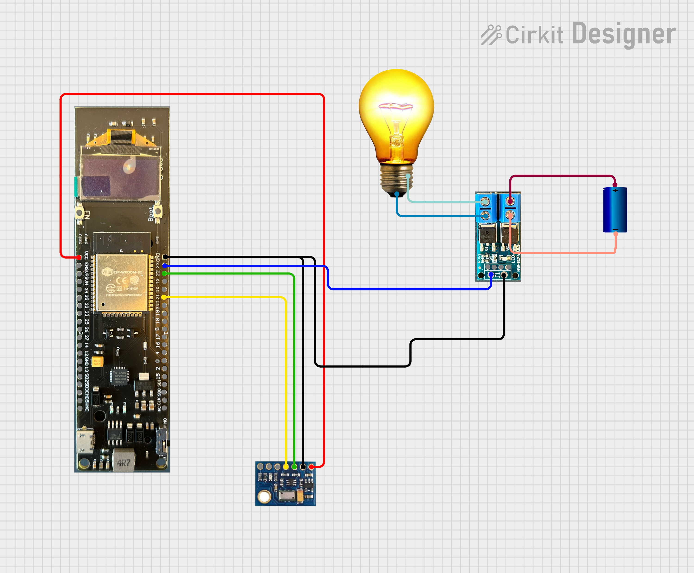

- Driver download: https://www.silabs.com/developers/usb-to-uart-bridge-vcp-drivers?tab=downloads

- pip install esptool

- esptool.py -p /dev/cu.SLAB_USBtoUART flash_id

- esptool.py -p /dev/cu.SLAB_USBtoUART -b 460800 --before default_reset --after hard_reset --chip esp32 write_flash --flash_mode dio --flash_freq 40m --flash_size 4MB 0x1000 bootloader/bootloader.bin 0x10000 VostokEspIdf.bin 0x8000 partition_table/partition-table.bin

- Flash download tool: https://www.espressif.com/sites/default/files/tools/flash_download_tool_3.9.6_1.zip
- Press BOOT during flashing!

Circuit
